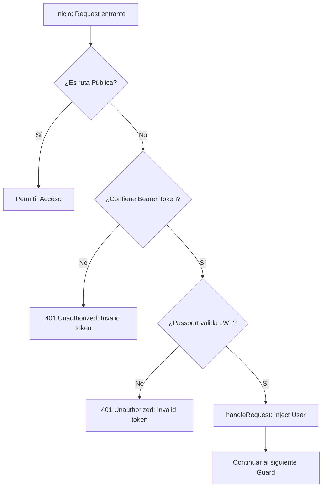

### JwtAuthGuard (Identidad)

```mermaid
flowchart TD
    A[Inicio: Request entrante] --> B{¿Es ruta Pública?}
    B -- Sí --> C[Permitir Acceso]
    B -- No --> D{¿Contiene Bearer Token?}
    D -- No --> E["401 Unauthorized: Invalid token"]
    D -- Sí --> F{¿Passport valida JWT?}
    F -- No --> G["401 Unauthorized: Invalid token"]
    F -- Sí --> H[handleRequest: Inject User]
    H --> I[Continuar al siguiente Guard]
```
