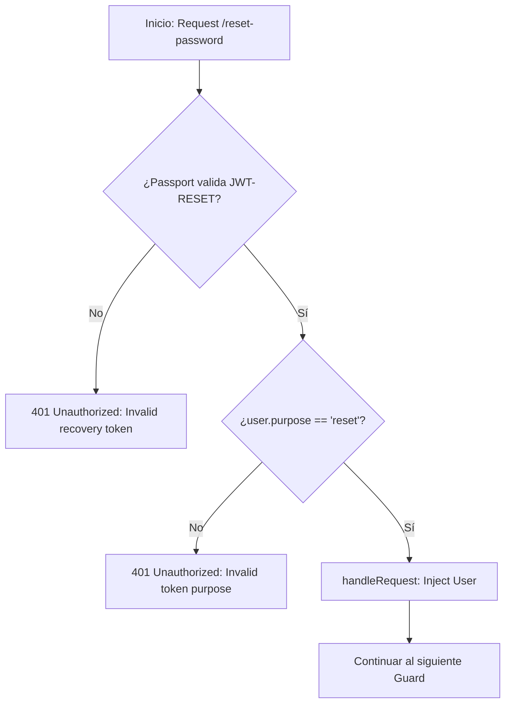

### PasswordResetGuard (Recuperación Stateless)

```mermaid
flowchart TD
    A[Inicio: Request /reset-password] --> B{¿Passport valida JWT-RESET?}
    B -- No --> C["401 Unauthorized: Invalid recovery token"]
    B -- Sí --> D{"¿user.purpose == 'reset'?"}
    D -- No --> E["401 Unauthorized: Invalid token purpose"]
    D -- Sí --> F[handleRequest: Inject User]
    F --> G[Continuar al siguiente Guard]
```
