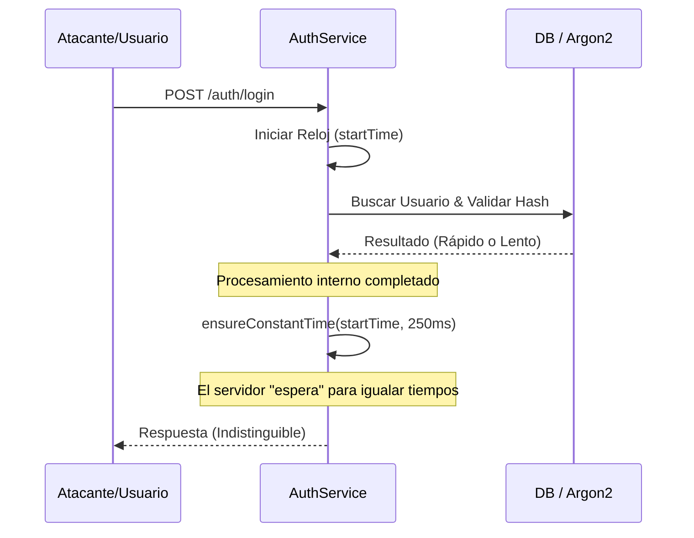
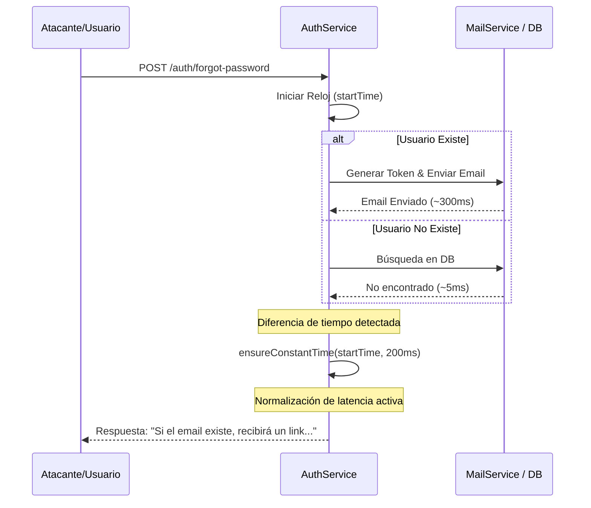

### Mitigación de Timing Attacks (Nivelación de Latencia)

#### login

```mermaid
sequenceDiagram
    participant A as Atacante/Usuario
    participant S as AuthService
    participant D as DB / Argon2
    A->>S: POST /auth/login
    S->>S: Iniciar Reloj (startTime)
    S->>D: Buscar Usuario & Validar Hash
    D-->>S: Resultado (Rápido o Lento)
    Note over S: Procesamiento interno completado
    S->>S: ensureConstantTime(startTime, 250ms)
    Note over S: El servidor "espera" para igualar tiempos
    S-->>A: Respuesta (Indistinguible)
```

#### forgot-password

```mermaid
sequenceDiagram
    participant A as Atacante/Usuario
    participant S as AuthService
    participant M as MailService / DB
    A->>S: POST /auth/forgot-password
    S->>S: Iniciar Reloj (startTime)
    alt Usuario Existe
        S->>M: Generar Token & Enviar Email
        M-->>S: Email Enviado (~300ms)
    else Usuario No Existe
        S->>M: Búsqueda en DB
        M-->>S: No encontrado (~5ms)
    end
    Note over S: Diferencia de tiempo detectada
    S->>S: ensureConstantTime(startTime, 200ms)
    Note over S: Normalización de latencia activa
    S-->>A: Respuesta: "Si el email existe, recibirá un link..."
```
