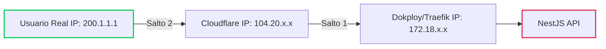

#### Escenario: Cloudflare + Dokploy (`TRUST_PROXY=2`)

```mermaid
graph LR
    User[Usuario Real IP: 200.1.1.1] -->|Salto 2| CF[Cloudflare IP: 104.20.x.x]
    CF -->|Salto 1| Traefik[Dokploy/Traefik IP: 172.18.x.x]
    Traefik --> NestJS[NestJS API]

    style NestJS stroke:#E0234E,stroke-width:2px
    style User stroke:#00C853,stroke-width:2px
```

> NestJS ignora a Traefik (1), ignora a Cloudflare (2) y resuelve correctamente la IP del Usuario (200.1.1.1).
